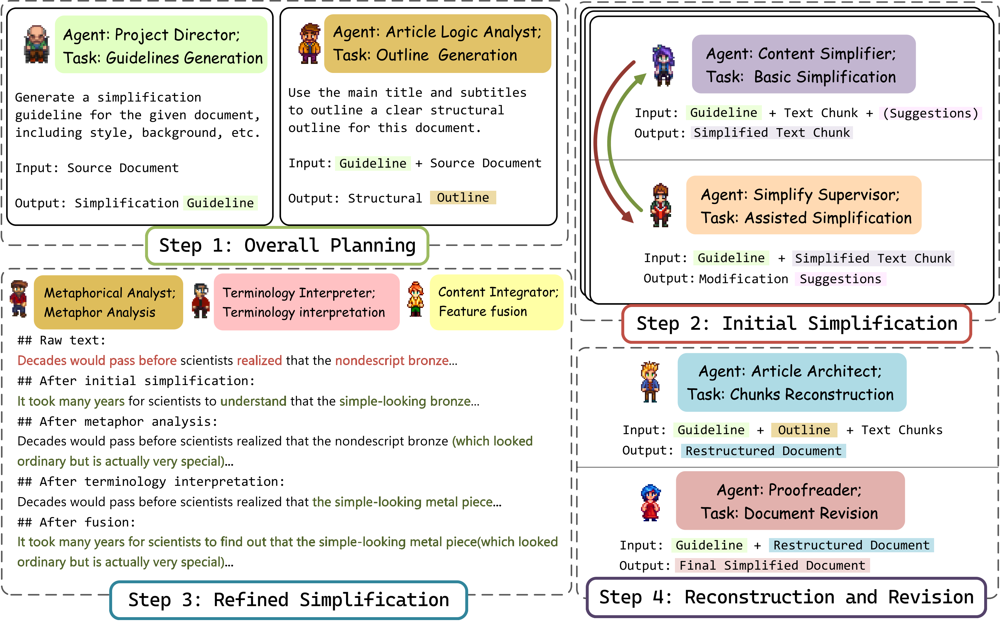

<h2 align="center">AgentSimp: A Multi-Agent Framework for Document Simplification</h2>

## AgentSimp

**Motivation**

We introduce AgentSimp, a framework that utilizes a collaborative multi-agent system based on large language models (LLMs) for document simplification, for a given document in need of simplification, each role assumes its respective duties.

  

**Framework**

In our framework, human crowdsourcing is no longer required, as all tasks are completed by intelligent agents. The entire process can be divided into the following four steps: (1) overall planning; (2) initial simplification; (3) refined simplification; (4) reconstruction and revision.

 
